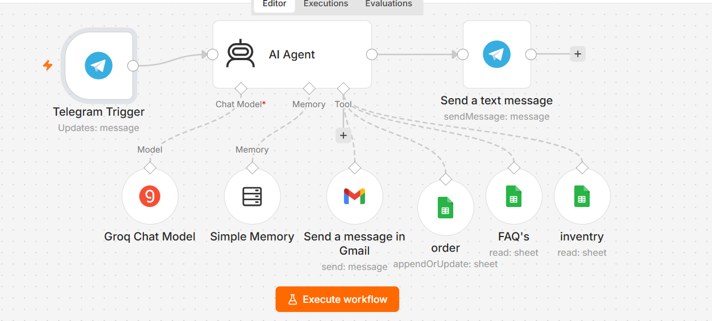
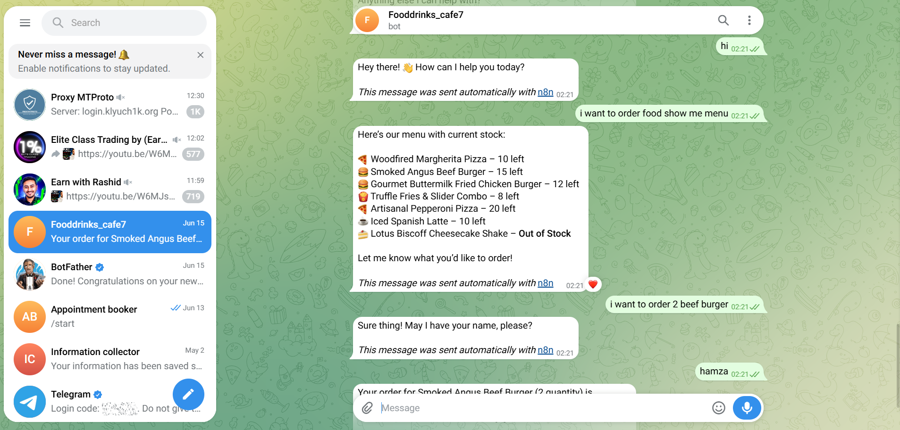
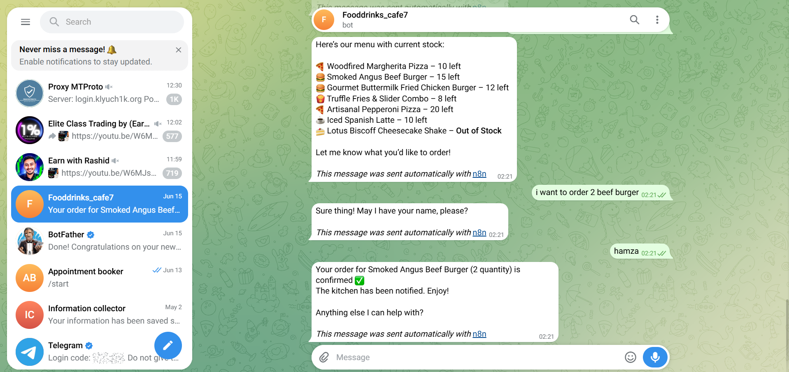
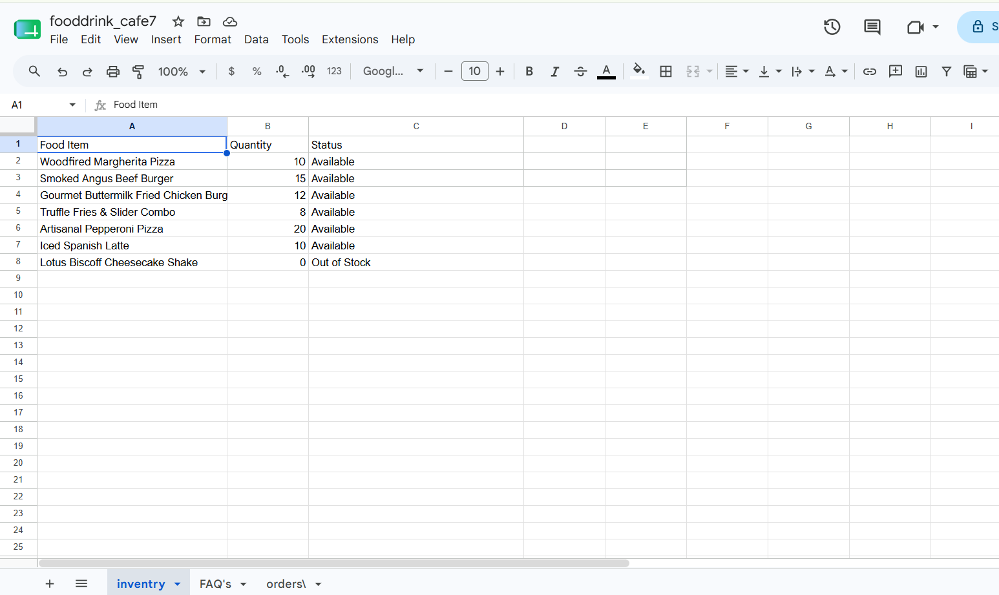
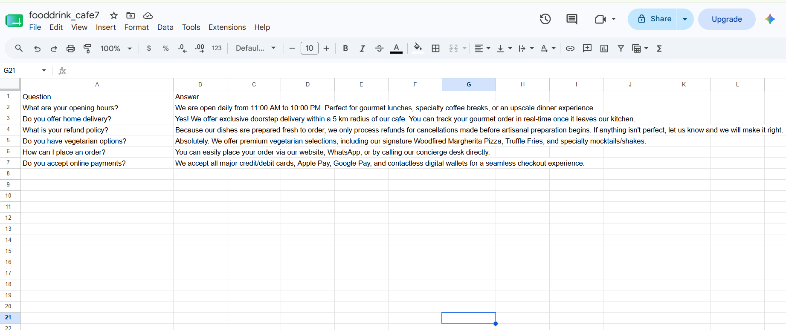
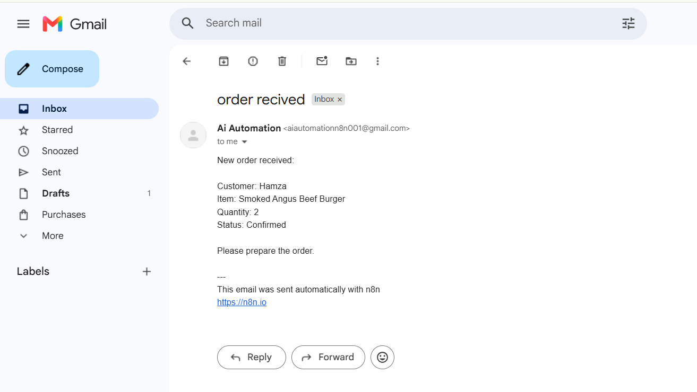

# 🍽️ AI Food Ordering Bot — Foodrinks Cafe

An intelligent, fully automated restaurant ordering system built with **n8n** 
that handles the complete customer journey via **Telegram** — from browsing 
the live menu to notifying the kitchen — with zero human involvement after setup.

---

## 🧠 Workflow Architecture

The entire system runs inside a single n8n workflow with an AI Agent at its 
core. The agent is powered by Groq LLM and has 4 tools connected to it — 
inventory checker, FAQ reader, order logger, and Gmail notifier. Every 
decision (confirm or reject) is made by the AI based on live data from 
Google Sheets.

---

## 🔄 How It Works — Step by Step

1. Customer sends any message to the Telegram bot
2. AI Agent greets the customer with 4 options
3. Customer requests the menu — bot fetches live stock from Google Sheets inventory tab
4. Customer places order by typing naturally (e.g. "I want 2 beef burgers")
5. AI asks for customer name
6. Bot checks Google Sheets inventory in real time before confirming
7. **If item is available:**
   - Sends confirmation message to customer on Telegram
   - Logs order to Google Sheets orders tab with status: Confirmed
   - Sends instant email notification to kitchen staff via Gmail
8. **If item is out of stock:**
   - Informs customer politely
   - Suggests available alternatives from inventory
   - Logs the attempt to Google Sheets with status: Rejected
9. Customer can also ask FAQs, check order status, or request cancellation

---

## 🖼️ Screenshots

### Telegram — Welcome Message & Live Menu

### Telegram — Order Placement & Confirmation

### Google Sheets — Live Inventory

### Google Sheets — Orders Log

### Google Sheets — FAQ Database

### Gmail — Kitchen Notification Email

---

## 🛠️ Tech Stack

| Tool | Purpose |
|------|---------|
| n8n | Core workflow automation engine |
| Groq LLM | AI brain — handles conversation, decisions, stock logic |
| Telegram Bot API | Customer-facing chat interface |
| Google Sheets API | Live inventory + order logging + FAQ storage |
| Gmail API | Instant kitchen staff notifications |
| Prompt Engineering | Conversation flow and response design |

---

## ✨ Key Features

- ✅ Live inventory check before every order — no manual stock checking needed
- ✅ Out of stock detection with automatic alternative suggestions
- ✅ Dual-outcome order logging — both Confirmed and Rejected orders saved
- ✅ Instant kitchen email the moment an order is confirmed
- ✅ FAQ answers pulled dynamically from Google Sheets
- ✅ Per-user conversation memory — remembers last 50 messages per user
- ✅ Natural food delivery app experience — no commands, just plain chat
- ✅ Order cancellation handled with owner contact redirect

---

## 🗂️ Google Sheets Structure

This workflow uses one Google Sheet with 3 tabs:

**Tab 1 — inventory**
| Food Item | Quantity | Status |
|-----------|----------|--------|
| Woodfired Margherita Pizza | 10 | Available |
| Smoked Angus Beef Burger | 15 | Available |
| Lotus Biscoff Cheesecake Shake | 0 | Out of Stock |

**Tab 2 — orders**
| Customer Name | Food Item | Quantity Ordered | Order Date | Status |
|---------------|-----------|-----------------|------------|--------|
| Hamza | Smoked Angus Beef Burger | 2 | 2026-06-15 | Confirmed |

**Tab 3 — FAQ's**
| Question | Answer |
|----------|--------|
| What are your opening hours? | 11:00 AM to 10:00 PM daily |
| Do you offer home delivery? | Yes, within 5km radius |

---

## 🤖 AI Agent Tools

The AI Agent has 4 tools it can call at any time:

| Tool | Type | What It Does |
|------|------|-------------|
| inventory | Google Sheets (read) | Checks food item stock before confirming order |
| FAQ's | Google Sheets (read) | Fetches answers to customer questions |
| order | Google Sheets (append/update) | Logs every order with status and timestamp |
| Gmail | Gmail Tool | Emails kitchen staff on confirmed orders |

---

## 📦 Setup Instructions

1. Import `workflow.json` into your n8n instance
2. Connect the following credentials:
   - Telegram Bot token (create via BotFather)
   - Google Sheets OAuth2
   - Gmail OAuth2
   - Groq API key (free at console.groq.com)
3. Create your Google Sheet with 3 tabs as shown above
4. Copy your Sheet ID from the URL and update it in all Google Sheets nodes
5. Update the kitchen email address in the Gmail node
6. Activate the workflow
7. Open Telegram, find your bot and send "hi"

---

## 🎯 Purpose

This project was built to demonstrate real-world automation skills including:
- AI Agent design with multiple tool integrations
- Live data fetching and decision making
- Multi-API workflow engineering
- Prompt engineering for natural conversation design
- End-to-end business process automation

---

## 👤 Author

**Mian Rehan** — AI Automation Developer
[LinkedIn](https://www.linkedin.com/in/muhammad-rehan-n8n/) | [GitHub](https://github.com/mianrehan05911-alt)
